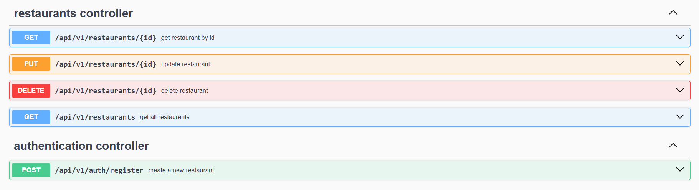
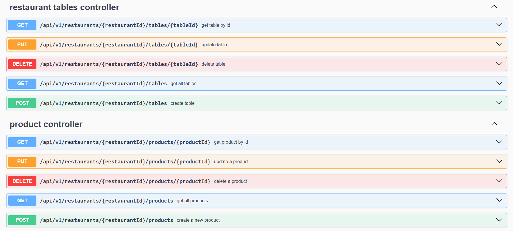
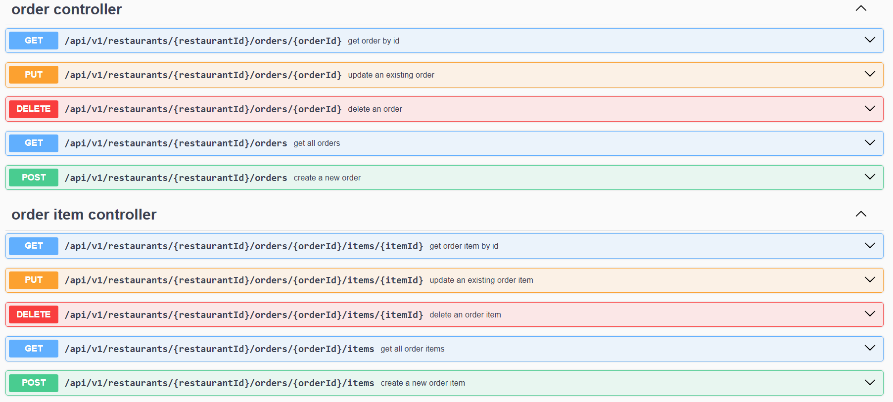
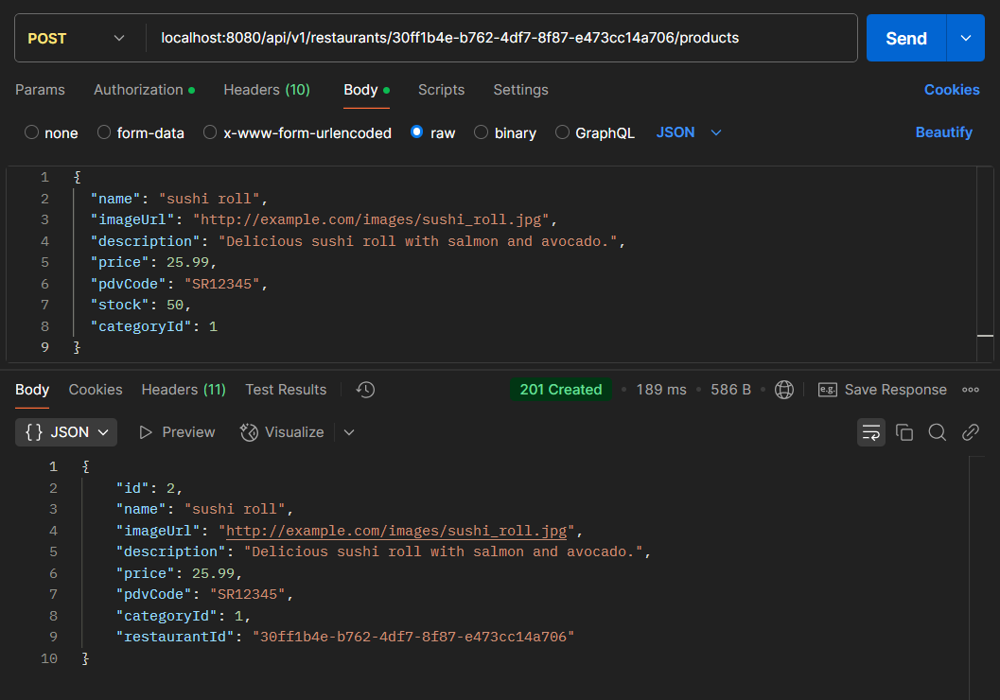
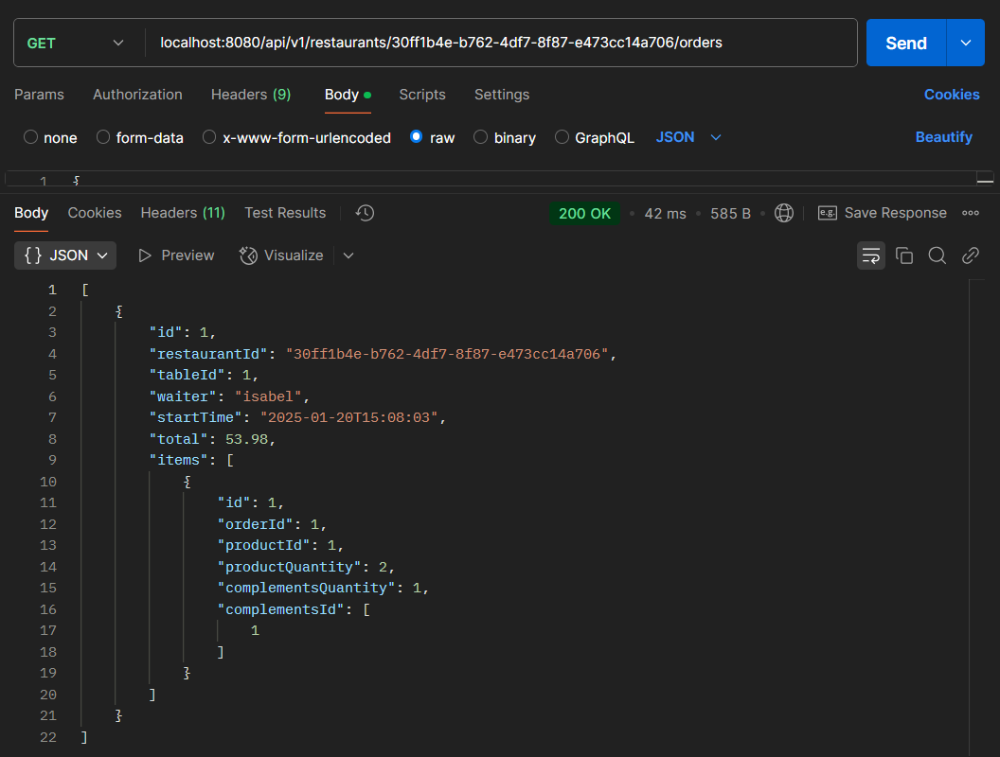
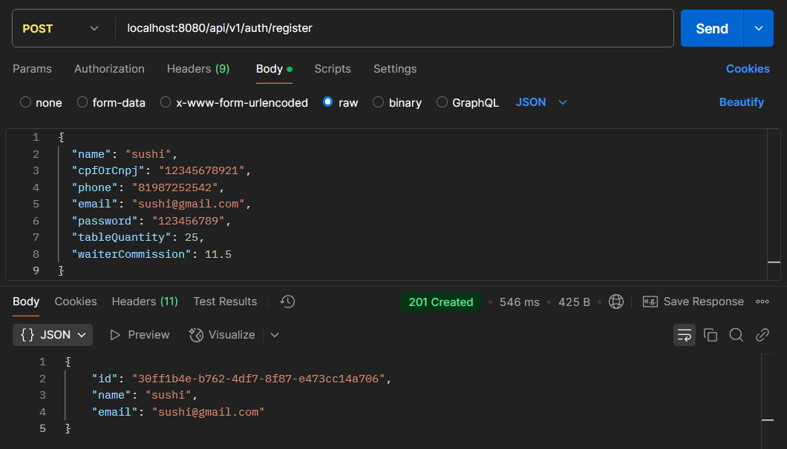

<h1 align="center">
  🍔 The Chef 🍔
</h1>

## Sobre o projeto

API REST desenvolvida para gerenciar restaurantes, oferecendo controle completo sobre cardápios, mesas, categorias, pedidos, produtos e complementos.

## Demonstração

    
<b>Documentação da API</b>

    
    
    

    
<b>Restaurante</b>

    

    
<b>Pedido</b>

    

    
<b>Autenticação</b>

    

## Tecnologias
- Linguagem: Java
- Framework: Spring Boot
- Banco de Dados: PostgreSQL
- Maven
- Flyway Migrations
- Spring Security (Basic Authentication)
- JUnit 5
- Mockito
- Docker
- SLF4J
- Swagger

## Configuração e Execução

Pré-requisitos: Java 17 / Maven
1. Clone o repositório
2. Instale as dependências do **pom.xml** com Maven
3. Crie o database no PostgreSQL com as configurações do **application.yml**
4. Execute o **Application.java**
5. Documentação **local**: [clique aqui](http://localhost:8080/swagger-ui/index.html)

## Autor
Isabel Henrique

https://www.linkedin.com/in/isabel-henrique/